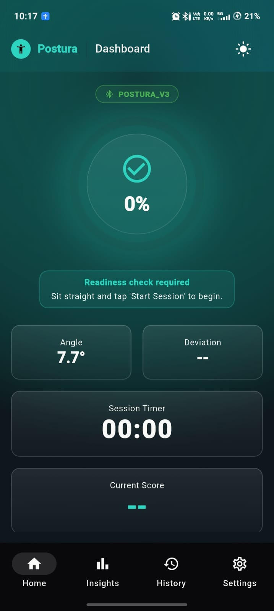
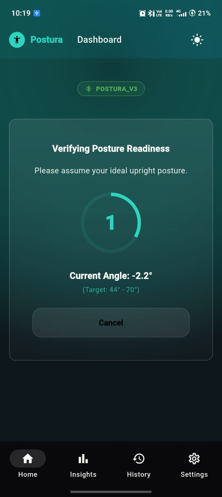
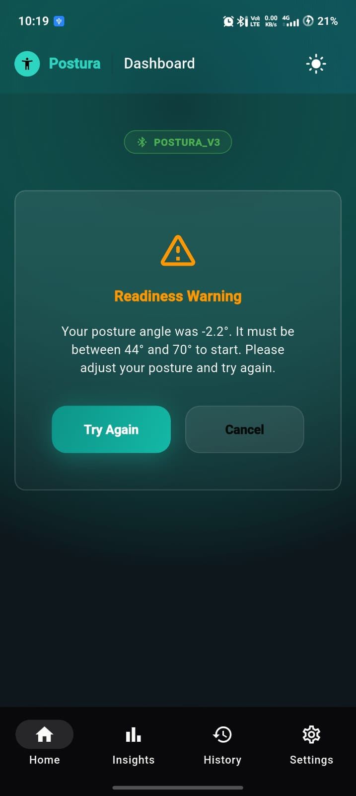
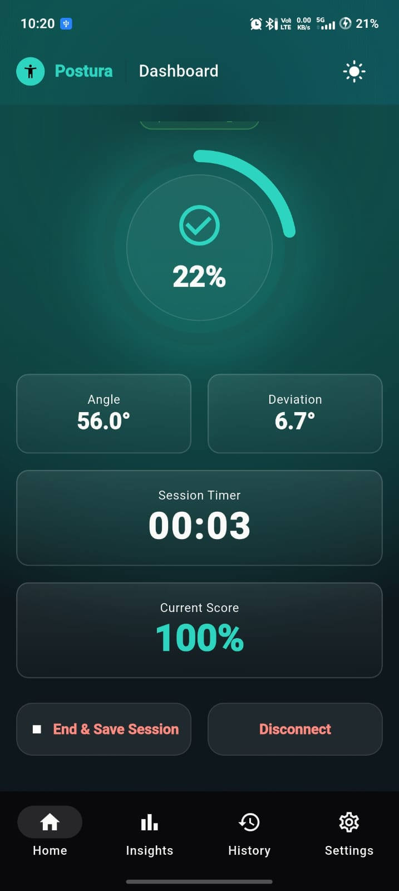
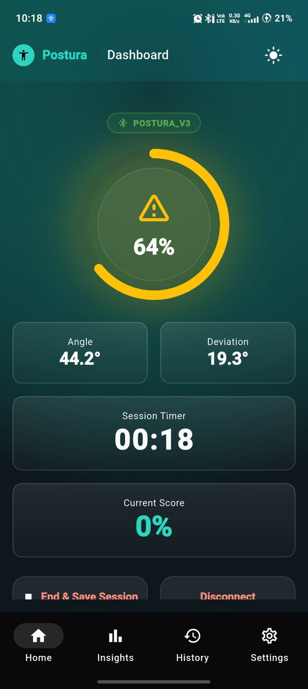

# Postura — Round 2 Demo Screenshots

This folder contains the visual evidence for the Postura implementation of **FAR AWAY 2026 — Round 2, Challenge #728: Operational Readiness: Conflict Check**.

The screenshots demonstrate the complete user flow from connecting the Postura wearable to detecting and resolving a conflict before the user starts an activity.

## Round 2 Flow

```text
BLE Connected
      ↓
Readiness Check
      ↓
Conflict Detection
      ↓
User Corrects Posture
      ↓
Readiness Check Again
      ↓
Ready
      ↓
Activity Started
```

---

## 1. BLE Connected

**File:** `ble-connected.jpeg`

Shows the Postura application connected to the physical Postura wearable through Bluetooth Low Energy (BLE).



---

## 2. Readiness Check

**File:** `readiness-check.jpeg`

Shows the user initiating the readiness check before starting an activity or session.



---

## 3. Conflict Detected

**File:** `conflict.jpeg`

Shows the application detecting and presenting a conflict during the readiness check.

The conflict is presented **before the activity or session begins**.



---

## 4. Posture Corrected

**File:** `corrected.jpeg`

Shows the posture after the user responds to the detected conflict and corrects their posture.


---

## 5. Ready

**File:** `ready.jpeg`

Shows that the readiness condition has been satisfied after the conflict has been resolved.



---

## 6. Activity Started

**File:** `started.jpeg`

Shows the final state after the readiness check has been successfully completed and the activity or session has started.



---

# Complete User Flow

```text
User wants to start
        ↓
Readiness Check
        ↓
Evaluate posture
        ↓
    Conflict?
     /     \
   No       Yes
   ↓         ↓
 Ready    Conflict
   ↓         ↓
   │      Correct
   │         ↓
   │    Check Again
   │         ↓
   └────→ Ready
             ↓
       Activity Starts
```

---

# Evidence Mapping

| Screenshot             | Demonstrates                             |
| ---------------------- | ---------------------------------------- |
| `ble-connected.jpeg`   | Wearable-to-app BLE connection           |
| `readiness-check.jpeg` | Readiness evaluation before action       |
| `conflict.jpeg`        | Early conflict detection                 |
| `corrected.jpeg`       | User response to the conflict            |
| `ready.jpeg`           | Conflict resolved and readiness achieved |
| `started.jpeg`         | User proceeds with the activity          |

---

# Why This Evidence Matters

The Round 2 challenge focuses on **operational readiness and conflict checking**.

The important part of the demonstration is not only detecting a conflict, but detecting it **before the user commits to the action**.

Postura demonstrates this through:

```text
User prepares to start
        ↓
Readiness Check
        ↓
Conflict detected early
        ↓
Conflict presented to user
        ↓
User corrects posture
        ↓
Readiness checked again
        ↓
User proceeds
```

---

# Prototype Threshold

The current Postura prototype uses a **15° posture-angle threshold** for the readiness check.

This is an application-level prototype parameter used to demonstrate the Round 2 workflow.

It is **not presented as a clinically validated medical threshold**.

---

# Evidence Requirements

The screenshots should:

* Show the actual Postura application.
* Represent the actual prototype workflow.
* Clearly show the relevant state in each step.
* Be readable without requiring the judge to inspect the source code.
* Demonstrate the sequence as one continuous user flow.

The screenshots should not be manually edited to represent functionality that has not actually been demonstrated.

---

# Round 2 Requirement Mapping

```text
Challenge Requirement
        ↓
Readiness before action
        ↓
Postura Readiness Check
        ↓
Early conflict detection
        ↓
Conflict presented before commitment
        ↓
User correction
        ↓
Re-evaluation
        ↓
Action allowed
```

---

# Files in This Folder

```text
screenshots/
├── README.md
├── ble-connected.jpeg
├── readiness-check.jpeg
├── conflict.jpeg
├── corrected.jpeg
├── ready.jpeg
└── started.jpeg
```

## Demo Sequence

The screenshots should preferably be viewed in this order:

**BLE Connected → Readiness Check → Conflict → Corrected → Ready → Started**

Together, they provide visual evidence of the complete Postura Round 2 readiness and conflict-checking workflow.
