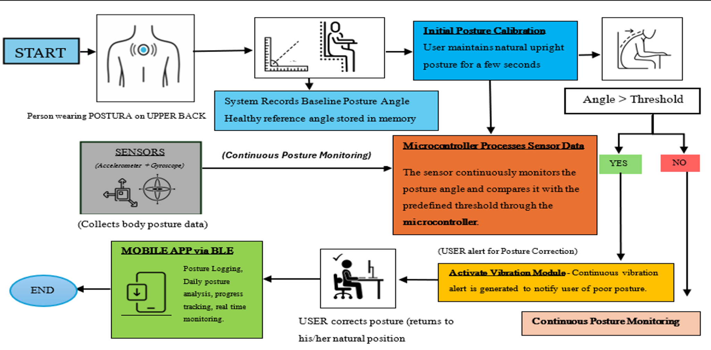

# Postura — System Architecture

## 1. System Overview

Postura is a wearable posture-monitoring system that combines physical sensing, embedded processing, Bluetooth Low Energy communication, and a companion application.

The system consists of three primary layers:

1. Wearable sensing layer
2. Communication layer
3. Application and decision layer

```text
┌─────────────────────────────────────────────┐
│              POSTURA SYSTEM                 │
└─────────────────────────────────────────────┘

        USER
         │
         │ Body posture
         ▼
┌─────────────────────┐
│     MPU6050 IMU     │
│  Posture sensing    │
└──────────┬──────────┘
           │
           │ Sensor data
           ▼
┌─────────────────────┐
│        ESP32        │
│ Processing + BLE    │
└──────────┬──────────┘
           │
           │ Bluetooth Low Energy
           ▼
┌─────────────────────┐
│   POSTURA APP       │
│                     │
│ Live angle          │
│ Readiness check     │
│ Conflict detection  │
│ Session management  │
└──────────┬──────────┘
           │
           │ User feedback
           ▼
┌─────────────────────┐
│   User decision     │
│                     │
│ Ready → Start       │
│ Conflict → Correct  │
└─────────────────────┘
```

## 2. Wearable Sensing Layer

The wearable device is responsible for measuring the user's physical posture.

### MPU6050

The MPU6050 provides inertial measurements that are used to determine the orientation and posture angle of the wearable.

The sensor communicates with the ESP32 through the I²C interface.

### ESP32

The ESP32 acts as the main controller of the wearable.

Its responsibilities include:

* Reading sensor measurements
* Processing posture data
* Determining posture angle
* Providing physical feedback
* Communicating posture data through BLE

### Physical Feedback

The wearable includes vibration feedback to provide immediate physical feedback when poor posture is detected according to the existing device logic.

## 3. Communication Layer

The wearable communicates with the Postura application using **Bluetooth Low Energy (BLE)**.

```text
MPU6050
   ↓
ESP32
   ↓
BLE
   ↓
Postura App
```

The application receives the live posture measurement from the wearable.

This allows the application to make decisions using real physical sensor data rather than simulated input.

## 4. Application Layer

The Postura application provides the user-facing interface.

Its responsibilities include:

* BLE device connection
* Live posture-angle display
* Readiness checking
* Conflict detection
* User guidance
* Session initiation
* Posture-related data presentation

## 5. Round 2 Decision Layer

The Round 2 feature introduces an additional decision layer before starting an activity.

```text
Live posture angle
        ↓
Readiness Check
        ↓
Compare against threshold
        ↓
   ┌────┴────┐
   │         │
   ▼         ▼
Within       Above
threshold   threshold
   │         │
   ▼         ▼
  READY    CONFLICT
   │         │
   │         ▼
   │    Correct posture
   │         │
   │         ▼
   │    Check again
   │         │
   └────┬────┘
        ▼
   Start activity
```

The prototype readiness threshold is **15°**.

If the live angle exceeds the threshold, the application presents a conflict state and asks the user to correct their posture before proceeding.

## 6. Separation of Responsibilities

A key architectural decision is to keep the Round 2 readiness logic inside the application.

### Firmware

The existing firmware handles:

* Sensor acquisition
* Embedded processing
* BLE communication
* Physical feedback

### Application

The application handles:

* Readiness evaluation
* Conflict detection
* User interaction
* Session flow

This separation allows the Round 2 prototype to build upon the existing wearable without requiring modifications to the packed ESP32 firmware.

## 7. Data Flow

The complete data flow is:

```text
User posture
     ↓
MPU6050
     ↓
ESP32 processing
     ↓
BLE transmission
     ↓
Flutter application
     ↓
Live posture angle
     ↓
Readiness evaluation
     ↓
Conflict / Ready state
     ↓
User action
```

## 8. Why This Architecture

The architecture is designed around a simple principle:

**Physical sensing should produce actionable decisions at the right moment.**

The wearable provides the physical measurement, while the application provides the contextual decision and user interaction.

This allows Postura to move beyond passive posture monitoring toward a preventive readiness workflow.
## System Flow Diagram

The following diagram represents the overall Postura sensing, processing, feedback, and application workflow.


